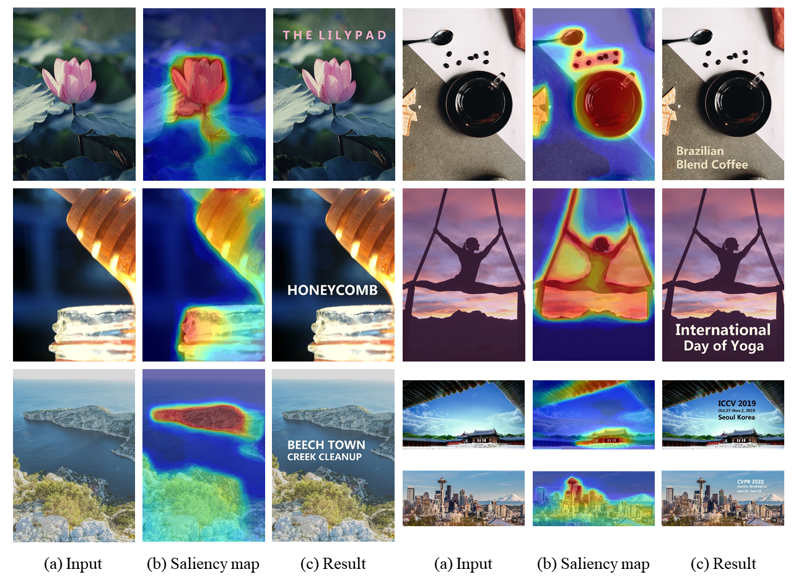

# Harmonious Textual Layout Generation over Natural Images via Deep Aesthetics Learning

**Code for the paper [Harmonious Textual Layout Generation over Natural Images via Deep Aesthetics Learning](http://chenhui.li/documents/TextualLayout_TMM2022.pdf) (TMM 2021).**



## Introduction
Automatic typography is important because it helps designers avoid highly repetitive tasks and amateur users achieve high-quality **textual layout** designs. However, there are often many parameters and complicated aesthetic rules that need to be adjusted in automatic typography work. In this paper, we propose an efficient deep aesthetics learning approach to generate harmonious textual layout over natural images, which can be decomposed into two stages, saliency-aware text region proposal and aesthetics-based textual layout selection. Our method incorporates both semantic features and visual perception principles.
First, we propose a semantic **visual saliency detection** network combined with a text region proposal algorithm to generate candidate text anchors with various positions and sizes. Second, a discriminative **deep aesthetics scoring** model is developed to assess the aesthetic quality of the candidate textual layouts. The results demonstrate that our method can generate harmonious textual layouts in various actual scenarios with better performance.

## Dependencies and Installation
+ Python 3
+ PyTorch >= 1.0

## Notes of compilation

1. For ```Python3``` users, before you start to build the source code and install the packages, please specify the architecture of your GPU card and CUDA_HOME path in both ```./roi_align/make.sh``` and ```./rod_align/make.sh```
2. Build and install by running: 
    ```bash
    bash make_all.sh
    ```

## Usage
1. Download the source code and the pretrained models: [gdi-basnet](https://drive.google.com/file/d/1dN_lqywxefd_R4Q93lZck0kEkfKo-wkj/view?usp=sharing) and [SMT](https://drive.google.com/file/d/1zKVA9IGkPtmRkm-2_m7qriaEwVXBuaGX/view?usp=sharing).

2. Make sure your device is CUDA enabled. Build and install source code of ```roi_align_api``` and ```rod_align_api```.

3. Run SmartText_demo.py to test the pretrained model on your images.
    ```bash
    python SmartText_demo.py -opt test_opt.yml
    ```

## Acknowledgement

This work is the extension of our [conference version](http://chenhui.li/documents/SmartText_ICME2020.pdf) (ICME 2020).
Some codes of this repository benefit from [BASNet](https://github.com/xuebinqin/BASNet) and [GAIC](https://github.com/lld533/Grid-Anchor-based-Image-Cropping-Pytorch). Thanks for their excellent work!

## Citation

If you find this work useful, please cite our paper:

```
@article{li2021harmonious,
    title     = {Harmonious Textual Layout Generation over Natural Images via Deep Aesthetics Learning},
    author    = {Li, Chenhui and Zhang, Peiying and Wang, Changbo},
    journal   = {IEEE Transactions on Multimedia},
    volume    = {24},
    pages     = {3416--3428},
    year      = {2021},
    publisher = {IEEE},
}
```

## Contact

If you have any question, contact us through email at zhangpeiying17@gmail.com.
